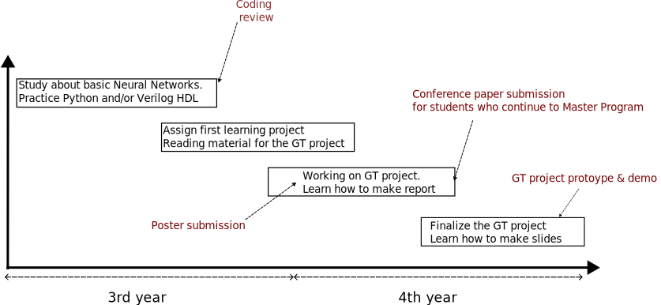

# GT Themes: 2024

**Note:** If you need more information, please get in touch with me via email at: khanh@u-aizu.ac.jp. My office is 204-I, Research Quadrangles.

## Introduction slides:

<iframe class="icenter"  src="https://docs.google.com/presentation/d/1i34l-0ZNI4D_b9ihc3g2LlMa9gvW08HfHTGPu14Zer8/embed?start=true&loop=true&delayms=3000" frameborder="0" width="960" height="569" allowfullscreen="true" mozallowfullscreen="true" webkitallowfullscreen="true"></iframe>

## Flow for Graduation

## Laboratory Guidelines

1. Our group consists of 2 Master students and 7 undergraduate students (see [Group Members](../grp_mem.html)).
2. Group meeting: twice a month (1st and 3rd week).
3. Face-to-face meeting with each student: twice a month (2nd and 4th week). This meeting can be flexible depending on the progress.
4. Lab meeting: twice a week.
5. From 4th year, you need to make presentations to report on working progress.
6. For excellent students, paper submissions and traveling for conferences (in Japan or abroad) are strongly recommended.

  ## What can you learn from the GT project

0. We have dedicated schedules and a well-managing system that can be adapted to different levels and styles of students. The professor is also very accessible and open to discussion. The lab environment is very friendly.
1. An English-speaking environment in which you can practice your English. We also have both Japanese students and international students (see [Group Members](../grp_mem.html))!
2. Working on actual prototypes and learning from them. (see [some sample projects by students here](../memtor.html))!
3. Learn how to make slides, how to present, how to answer questions, and how to write reports.
4. **For excellent students, you will learn how to write a paper, travel abroad, and present**. See [this paper](https://ieeexplore.ieee.org/abstract/document/10616602) for an example of a B4 student's paper.

   
## Topics
### Power-Efficient Spiking Neural Network

This project aims to research and implement an adaptive, low-power spiking neural network system in hardware (NASH) based on our earlier-developed OASIS communication network. NASH implements the following features (1) an efficient adaptive configuration method that enables reconfiguration of different SNN parameters (spike weights, routing, hidden layers, topology, etc.), (2) a mixture of different deep NN topologies, (3) an efficient fault-tolerant multicast spike routing algorithm, (4) Efficient on-chip learning mechanism. To demonstrate the performance of the NASH system, an FPGA implementation shall be developed and  a VLSI implementation shall also be established.

Students can work on software (Python), or hardware (VLSI/FPGA) or both.

#### Demonstration of previous design

1. See this slide for the demo: [2023_Demo_FPGA.pdf](../share/projects/CRF-2023/2023_Demo_FPGA.pdf).
2. Video of the SNN SoC on FPGA:

{::nomarkdown}

<table class="icenter" width="80%">
<tbody>

  <tr>
    <td >
    <video width="100%" controls>
    <source src="../../share/projects/CRF-2023/2023_Demo_FPGA.m4v" type="video/mp4">
    </video>
    </td>
  </tr>

</tbody>
</table>
{:/}

#### Reading materials

- Example project report by B4 student: [conference paper](https://ieeexplore.ieee.org/abstract/document/10616602).
- Work by master student: https://ieeexplore.ieee.org/document/10269541
- Work by master student: https://ieeexplore.ieee.org/document/10207021

### Low-power Generative Adversarial Network

A low-power Generative Adversarial Network (GAN) is an energy-efficient version of a traditional GAN, optimized for environments with limited computational resources. By using techniques like model compression and approximate computing, it reduces energy consumption, enabling real-time data generation on low-power devices like smartphones, IoT systems, and neuromorphic hardware.

In this project, you will design a baseline  Generative Adversarial Network in Pytorch or Verilog HDL and reduce the power consumption using our own previously designed techniques such as approximate computing, approximate memory, or data compression

Students can work on software (Python), or hardware (VLSI/FPGA) or both.

### "Green" AI Computing (You can pick your AI application)

This is a free project where you can propose your own idea of AI computing with our power-efficient techniques ("Green" AI). If you have an application in mind, please join and propose. We will listen to you and support you!

In this project, you will deploy AI model in combination with our power efficient techniques:

- Weight ternary: Paper: https://doi.org/10.1016/j.micpro.2022.104458 (open source: https://github.com/klab-aizu/TW-SNN)
- Approximate 3D Stack Memory: https://doi.org/10.1109/TVLSI.2023.3318231
- Approximate Neuron Circuit Design: https://doi.org/10.1109/ICDV61346.2024.10616602

これは、当社の電力効率の高い技術 (「グリーン」AI) を使用した AI コンピューティングに関する独自のアイデアを提案できる無料のプロジェクトです。アプリケーションをお考えの場合は、ぜひ参加して提案してください。私たちはあなたの意見に耳を傾け、サポートします。

このプロジェクトでは、当社の電力効率の高い技術と組み合わせて AI モデルを展開します。

- 重み三元: 論文: https://doi.org/10.1016/j.micpro.2022.104458 (オープン ソース: https://github.com/klab-aizu/TW-SNN)
- 近似 3D スタック メモリ: https://doi.org/10.1109/TVLSI.2023.3318231
- 近似ニューロン回路設計: https://doi.org/10.1109/ICDV61346.2024.10616602

#### Notes:

- You can propose our own AI application. 独自のAIアプリケーションを提案できます。If you want to start your company with AI computing, we welcome and support you! AIコンピューティングで会社を立ち上げたい方は、ぜひご応募ください。
- We can even file a patent with your technology if you want! See our previous patents: https://u-aizu.ac.jp/~khanh/pub.html#patent. ご希望であれば、あなたの技術で特許を申請することもできます。以前の特許をご覧ください: https://u-aizu.ac.jp/~khanh/pub.html#patent

 

