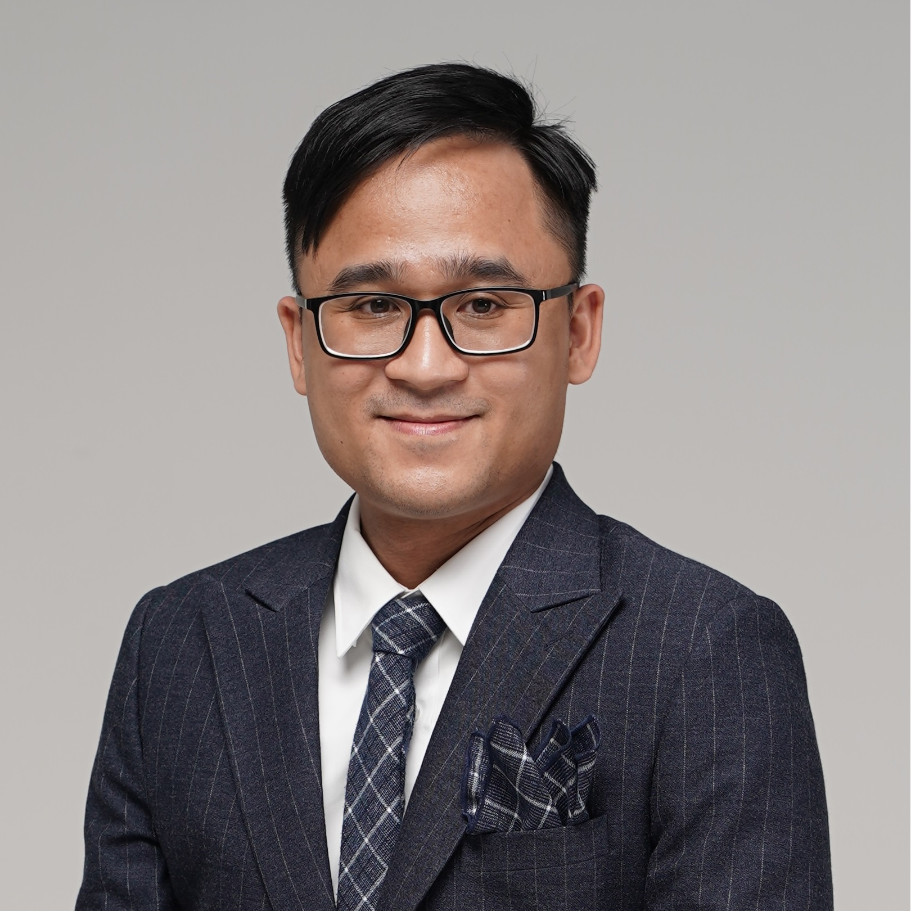

---
hide:
- navigation
- toc
---

# ようこそ！

{class="avatar"}

Hello! My name is Khanh N. DANG (1).
I am currently an **Associate Professor** in the Division of Computer Engineering, Department of Computer Science and Engineering, [The University of Aizu](https://www.u-aizu.ac.jp/en/). I earned my Ph.D. from [The University of Aizu](https://www.u-aizu.ac.jp/en/) and my M.Sc. from [Paris XI University](https://en.wikipedia.org/wiki/Paris-Sud_University) (now [Paris-Saclay University](https://www.universite-paris-saclay.fr/en)). Prior to joining the University of Aizu, I worked at [Vietnam National University, Hanoi](https://vnu.edu.vn/eng/) and [Dolphin Technology, Inc.](https://www.dolphin-ic.com/).
{ .annotate }

1.  In Vietnamese: Đặng Nam Khánh In Japanese: ダン ナム カイン In Chinese: 鄧南慶

**Research Interests:** My current research covers three key topics: *carbon-efficient & sustainable computing* (1), *3D-IC technology*, and *neuromorphic computing*. I am particularly interested in advancing computing architectures that achieve ultra-low-power and scalable solutions, paving the way for safe, responsible real-world deployment. In addition, I am committed to exploring carbon-neutral computing—an approach that minimizes the carbon footprint of computing systems by optimizing energy efficiency, leveraging renewable energy sources, and designing sustainable hardware solutions. This aligns with my goal to contribute to environmentally responsible innovation in computing technology.
{ .annotate }

1.  Starting November 2024, this website will default to dark mode to [reduce power consumption on OLED and AMOLED screens](https://dl.acm.org/doi/pdf/10.1145/3458864.3467682), aligning with our commitment to sustainability and carbon neutrality.

!!! info "Join us!"
    - Research opportunities in VLSI design, carbon-efficient computing, and neuromorphic computing are available for GT undergraduate and graduate students. 
    - Postdoc positions are also available. However, please only [contact me](contact.md) if you published at least two journal papers belong to this [list](resource.md/#journals-alphabetical-order).
    - Interested candidates are encouraged to check [this page](joinus.md) to know more.

