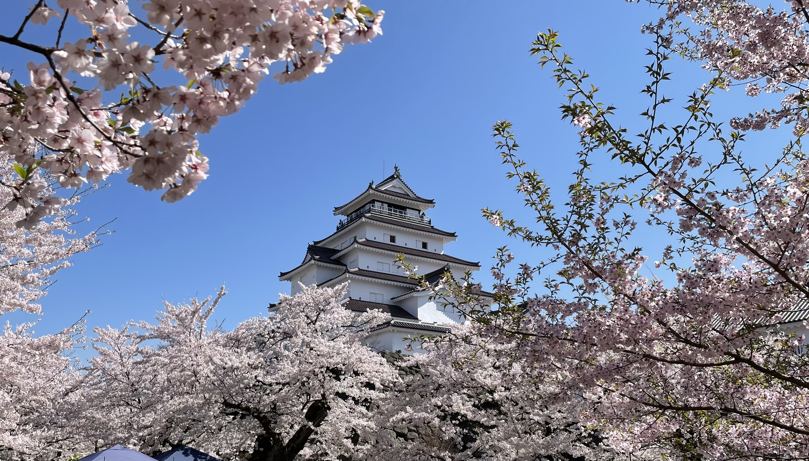

# New Chapter: Returning to the University of Aizu

I’m happy to share that I’ve returned to the University of Aizu as an Associate Professor. Having been part of this community before, it’s exciting to come back and contribute in a new role.

<!-- more -->

The University of Aizu has always been a place of innovation and collaboration, and I’m looking forward to teaching, mentoring students, and continuing research in areas that can make a meaningful impact.

It’s great to be back among familiar faces and to work alongside talented colleagues and motivated students. I’m excited to see where this next chapter leads.

As I prepare to begin my new role at the University of Aizu, it’s also time to say goodbye to VNU-UET. My time here has been incredibly rewarding, filled with opportunities to teach, collaborate, and grow both personally and professionally.

While settling back into Aizu, I took a moment to visit Tsuruga-jo, a place that beautifully reflects the history and spirit of the region. Though it’s not part of the university, it felt like the perfect spot to reconnect with the surroundings and reflect on this new chapter.

Here’s a ==moment== from Tsuru-ga-jō (鶴ヶ城):

