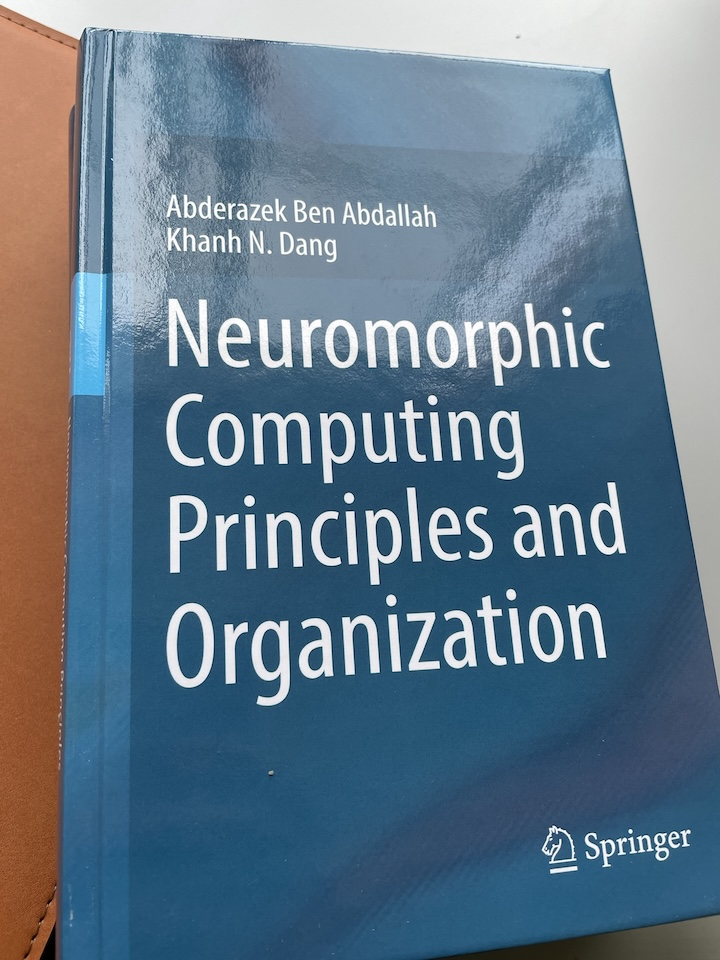

# The Hard Copy of the Book Has Arrived!

I’m happy to share that the hard copy of my book has finally arrived! It’s been a long journey, and I’m grateful to see all the hard work come to life.

<!-- more -->
This book explores the principles and applications of neuromorphic computing, and I hope it will be a valuable resource for those interested in this exciting field.

Big Thank to Prof. Ben for leading the project and thank to everyone who has supported me throughout this process!

You can purchase the book on [Amazon](https://www.amazon.com/dp/3030925242/ref=cm_sw_em_r_mt_dp_FDNTBNH4591SBQ769MZH) or directly via [Springer](https://link.springer.com/book/9783030925246) (separate chapters are also available).

Looking forward to your thoughts and feedback!

!!! quote ""
    Here’s a ==moment== of the book:
    
    
