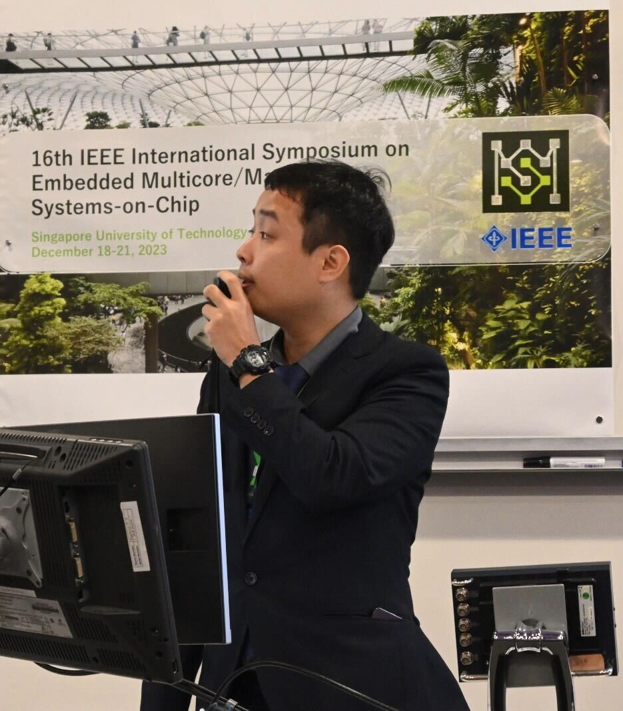

# MCSoC 2023: A Great Experience
Doanh had the opportunity to attend the IEEE 2023 International Symposium on Embedded Multicore/Many-core Systems-on-Chip (MCSoC) to present his paper, "A Novel Yield Improvement Approach for 3D Stacking Neuromorphic Architecture." The conference brought together researchers from around the world to discuss developments in multicore and many-core system-on-chip technologies.
<!-- more -->

At the event, Doanh presented his work, participated in discussions with other researchers, and learned about new trends in embedded systems.

Here is his ==moment== from MCSoC 2023:

Thank you to the organizers, colleagues, and participants for making MCSoC 2023 an unforgettable experience!

