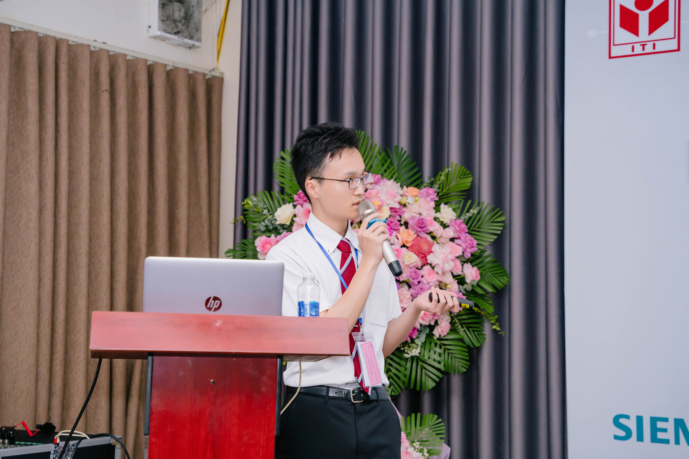
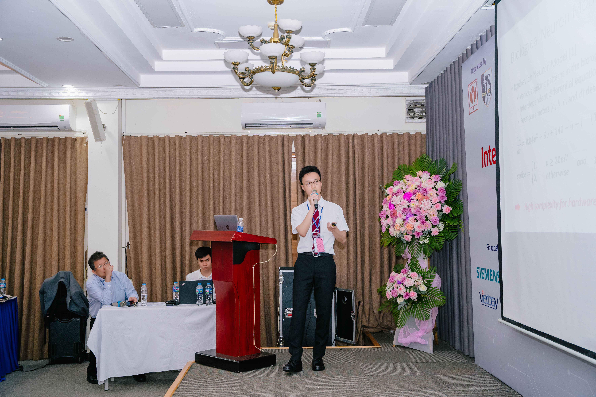

# Presenting at ICDV 2024

We’re excited to share that Ryoji Kobayashi, now in his 4th year of undergraduate study, presented his first paper at the 2024 9th IEEE International Conference on Integrated Circuits, Design, and Verification (ICDV), held from June 6–8, 2024.
<!-- more -->

The paper, titled:

"An Efficient Hardware Implementation of Spiking Neural Network Using Approximate Izhikevich Neuron",

focuses on a hardware implementation of Spiking Neural Networks using an approximate Izhikevich neuron model. The work strikes a balance between computational efficiency and biological realism, contributing to progress in neuromorphic computing.

Kobayashi’s presentation sparked interesting discussions with attendees and highlighted the practical aspects of our work.

Here are a few photos from the event:

Thank you to everyone at ICDV 2024 for making it a meaningful experience.
