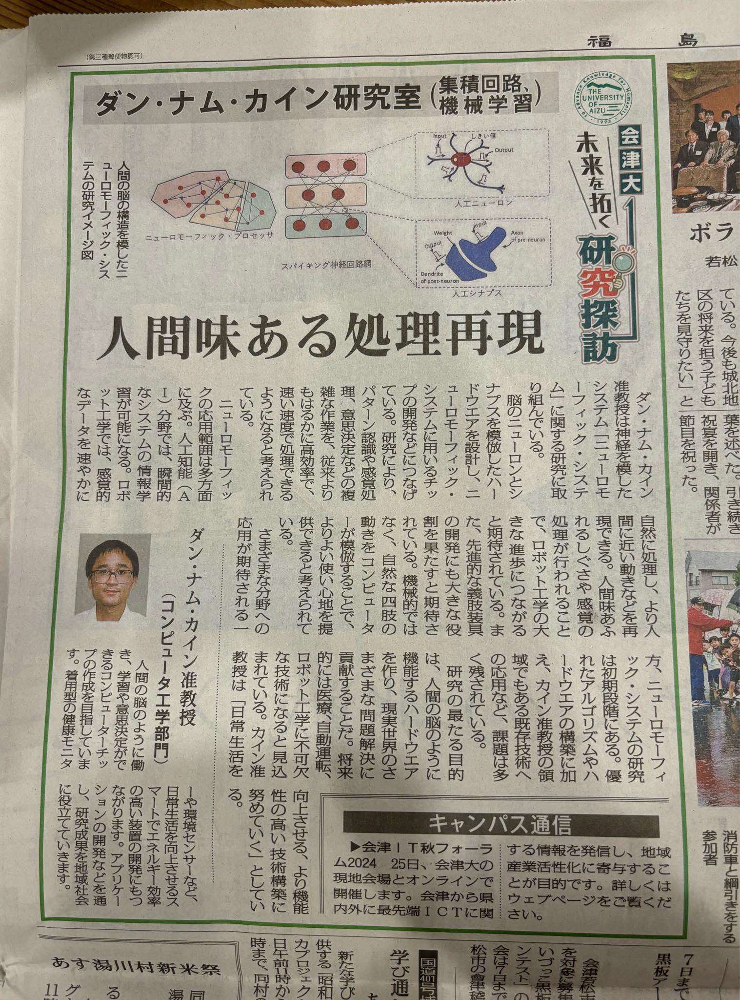

# Grateful for the Opportunity

I am deeply honored to have been featured in Fukushima Minpo Newspaper's series, “University of Aizu: Exploring Research for the Future,” published on 5 October. This opportunity allowed me to share a glimpse of my research and its potential contributions to the future of technology.
<!-- more -->

I sincerely thank the Planning and Public Relations Section for their invaluable support throughout this process. A special note of gratitude to Takashi Saito-さん and Oshima-さん for their kind guidance and encouragement.

I also want to thank Kameyama-さん, the reporter, for their patience and understanding as I did my best to explain my work, and the staff members of the University of Aizu for their support.

I am especially grateful to my student, Hanyu Yuga-さん, for his generous help in reviewing and translating the content, which made the communication process much smoother.

This experience has been truly humbling, and I hope it sparks curiosity about the exciting research happening at the University of Aizu.

ありがとうございます 🙇

!!! quote ""
    Here is the =="moment"==:
      

