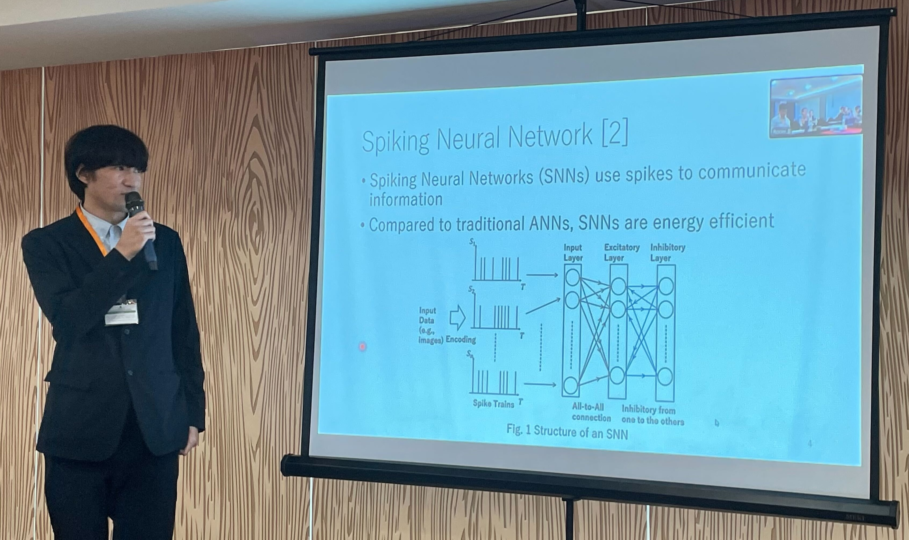
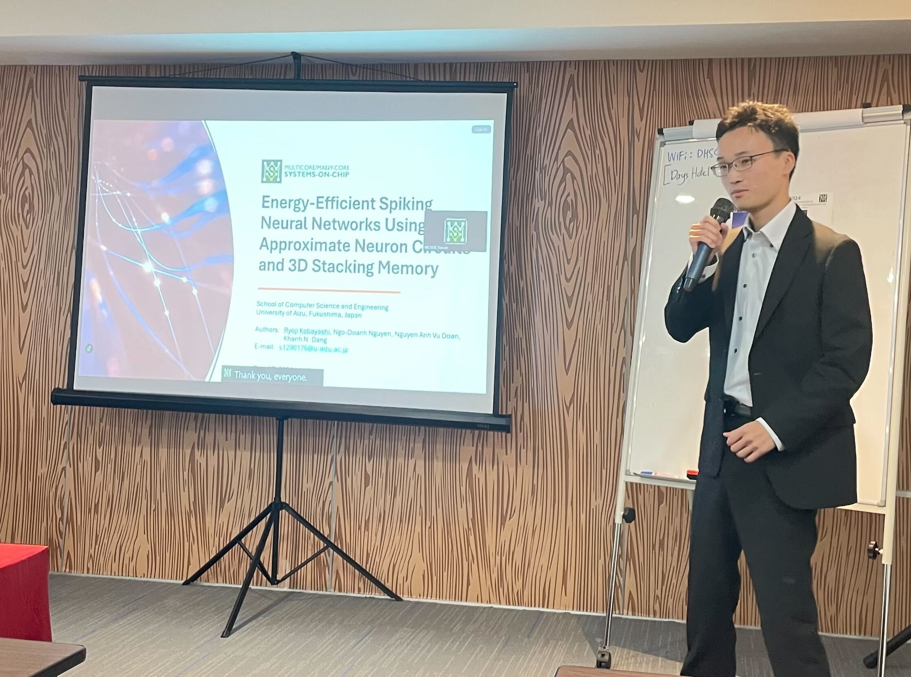
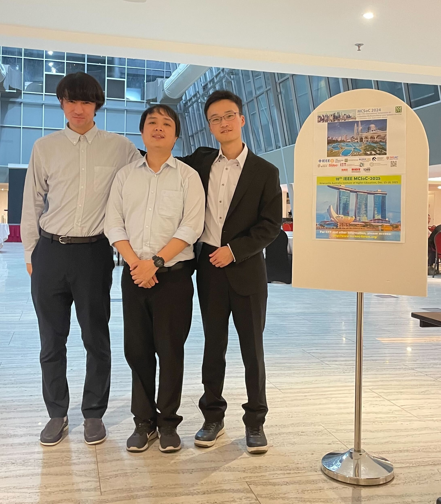

# Two Papers by Undergraduate Students Presented at IEEE MCSoC 2024 in Kuala Lumpur  

We are excited to share that two of our papers were presented at the 2024 IEEE 17th International Symposium on Embedded Multicore/Many-core Systems-on-Chip (MCSoC), held from December 16–19, 2024, in Kuala Lumpur, Malaysia.  
<!-- more -->

## 1. EnsembleSTDP: Distributed In-situ Spike Timing Dependent Plasticity Learning in Spiking Neural Networks  
**Authors:** Yuga Hanyu and Khanh N. Dang  

This paper introduces **EnsembleSTDP**, a distributed in-situ learning mechanism for Spiking Neural Networks (SNNs). The method leverages Spike Timing Dependent Plasticity (STDP) to enable efficient, unsupervised online learning. EnsembleSTDP enhances training speed and scalability, making it suitable for neuromorphic hardware implementations.  

**Yuga Hanyu さん**, a 4th-year undergraduate student, presented this work. He has done an excellent job contributing to the research and preparing for this presentation.  

!!! quote ""
    Here is Yuga Hanyu さん's =="moment"==:
      

## 2. Energy-Efficient Spiking Neural Networks Using Approximate Neuron Circuits and 3D Stacking Memory  
**Authors:** Ryoji Kobayashi, Ngo-Doanh Nguyen, Nguyen Anh Vu Doan, and Khanh N. Dang  

This paper proposes an energy-efficient approach to Spiking Neural Networks by combining approximate neuron circuits with 3D stacking memory. The research focuses on reducing power consumption while maintaining high performance, offering promising solutions for low-power neuromorphic computing applications.  

**Ryoji Kobayashi さん**, also a 4th-year undergraduate student, presented this work. This is his second paper and presentation at an IEEE conference, demonstrating his growing expertise and commitment to advancing neuromorphic computing research.  

!!! quote ""
    Here is Ryoji Kobayashi さん's =="moment"==:
      

We are incredibly proud of Hanyu-さん and Kobayashi-さん for their contributions and dedication. Their work highlights the outstanding potential of young researchers, and we look forward to their continued success.  

This time, we also had a mini lab reunion with Mr. Nguyen Ngo Doanh, who graduated last March and has since embarked on his journey to Italy for his Ph.D. Mr. Doanh stopped by MCSoC 2024 to spend a couple of days with our current members. He is also a co-author of the second paper.  

!!! quote ""
    Here is the reunion =="moment"==:
      

A big thank you to everyone for their hard work and contributions—it’s your dedication that makes such moments and achievements possible!
