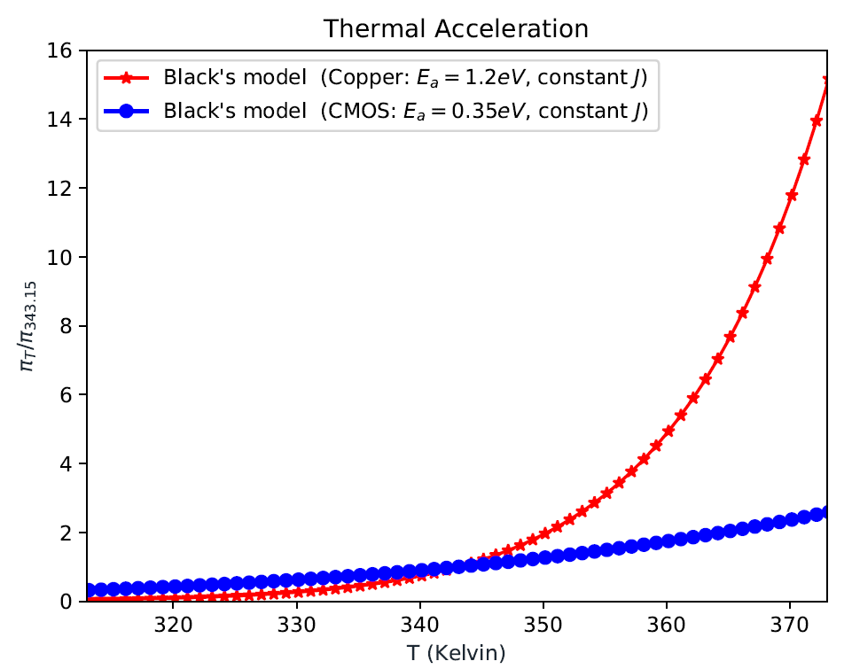
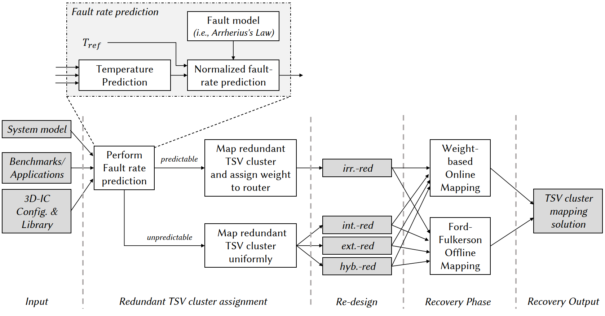

# NAFOSTED (Ref. No. 102.01-2018.312): Hotspot aware Fault-Tolerant Architectures and Algorithms for TSV-based 3D Network-on-Chips  (2019-2021)

## Project Summary

In this project, we solve the reliabilty challenges of Through-Silicon-Via based 3D Integrated Circuits with hotspot awareness. When hotspots occur, they accelerate the fault rates of their regions which lead to the need of both temporal and spatial system adaptations. Also, hotspots could be the consequences of using fault-tolerance. Therefore, we target to make the 3D-ICs not only support fault tolerance with variable fault-rates and fault distribution but also be adaptable to the occurrences of thermal hotspots.

{::nomarkdown}

{:/}
*Caption: Thermal Impact on Reliability using Black's Model: Copper (TSV's material) and CMOS (see: [https://arxiv.org/abs/2003.08648](https://arxiv.org/abs/2003.08648))*

{::nomarkdown}

{:/}
*Caption: Final Framework of TSV Placement (see: \[[DOI: 10.1109/TCAD.2021.3069370](https://doi.org/10.1109/TCAD.2021.3069370)\])*

This projected is funded by NAFOSTED - National Foundation for Science and Technology Development ([https://nafosted.gov.vn/en/](https://nafosted.gov.vn/en/)) from 2019 to 2021.

## Project's Output

### Journal 

8. **Khanh N. Dang**, Akram Ben Ahmed, Abderazek Ben Abdallah, Xuan-Tu Tran, *''HotCluster: A thermal-aware defect recovery method for Through-Silicon-Vias Towards Reliable 3-D ICs systems''*, **IEEE Transactions on Computer-Aided Design of Integrated Circuits and Systems**, IEEE, Volume 41, No. 4,  pp. 799-812, April 2022. \[[DOI: 10.1109/TCAD.2021.3069370](https://doi.org/10.1109/TCAD.2021.3069370)\]/\[[PDF](../share/pubs/TCAD-2021.pdf)\].
12. **Khanh N. Dang**, Akram Ben Ahmed, Abderazek Ben Abdallah, Xuan-Tu Tran, *''A thermal-aware on-line fault tolerance method for TSV lifetime reliability in 3D-NoC systems''*, **IEEE Access**, IEEE, Volume 8, pp. 166642-166657, 2020. \[[DOI: 10.1109/ACCESS.2020.3022904](https://doi.org/10.1109/ACCESS.2020.3022904 )\]/\[[PDF](../share/pubs/ACCESS-2022-2.pdf)\].
13. **Khanh N. Dang**, Akram Ben Ahmed, Ben Abdallah Abderrazak and Xuan-Tu Tran, *''TSV-OCT: A Scalable Online Multiple-TSV Defects Localization for Real-Time 3-D-IC Systems''*, **IEEE Transactions on Very Large Scale Integration Systems (TVLSI)**, IEEE, Volume 28, Issue 3, pp. 672 - 685, 2020. \[[DOI: 10.1109/TVLSI.2019.2948878](https://doi.org/10.1109/TVLSI.2019.2948878)\]/\[[PDF](../share/pubs/TVLSI-2019.pdf)\].

### Conference

11. **Khanh N. Dang**, Akram Ben Ahmed, Fakhrul Zaman Rokhani, Abderazek Ben Abdallah, and Xuan-Tu Tran, *''A thermal distribution, lifetime reliability prediction and spare TSV insertion platform for stacking 3D NoCs''*, **2020 International Conference On Advanced Technologies For Communications (ATC)**, Nov. 8-10, 2020.
17. **Khanh N. Dang**, Akram Ben Ahmed, Ben Abdallah Abderrazak and Xuan-Tu Tran, *''TSV-IaS: Analytic analysis and low-cost non-preemptive on-line detection and correction method for TSV defects''*, **The IEEE Symposium on VLSI (ISVLSI) 2019**, Jul. 15-17, 2019.
15. **Khanh N. Dang**, Michael Meyer, Akram Ben Ahmed, Abderazek Ben Abdallah, and Xuan-Tu Tran, *''2D-PPC: A single-correction multiple-detection method for Through-Silicon-Via Faults''*, **2019 IEEE Asia Pacific Conference on Circuits and Systems (APCCAS)**, Nov. 11-14, 2019.

### Other

1. **Khanh N. Dang**, Akram Ben Ahmed, Ben Abdallah Abderrazak and Xuan-Tu Tran, *''Thermal distribution and reliability prediction for 3D Networks-on-Chip''*, **VNU Journal of Computer Science and Communication Engineering**, VNU, Volume 36, No 1, pp. 65-77, 2020. \[[DOI:10.25073/2588-1086/vnucsce.245]( https://doi.org/10.25073/2588-1086/vnucsce.245)\].
2. **Khanh N. Dang**, Michael Meyer, Akram Ben Ahmed, Abderazek Ben Abdallah, and Xuan-Tu Tran, *''2D Parity Product Code for TSV online fault correction and detection''*, **REV Journal on Electronics and Communications (JEC)**, REV, pp. 11-21, Vol. 8, No. 1-2, Jan. - Jun., 2020. \[[DOI: 10.21553/rev-jec.242](http://dx.doi.org/10.21553/rev-jec.242)\]. 