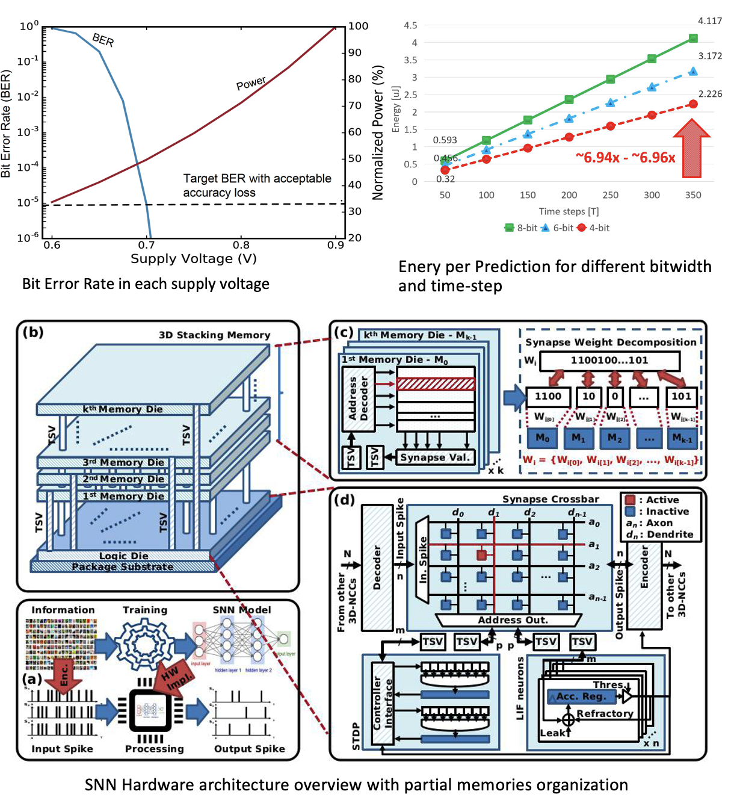

---
hide:
- navigation
---

#  Competitive Research Funding (Ref. 2023-26):  Low-power Spiking Neural Network Solution for IoT and Edge devices (2023)

## Project Summary

In this project, we develop a low-power solution for spiking neural networks using stacking 3D memory.
Here, we split the weight of N-bit into several subsets and each subset is put into separated layers. We apply power-gating (dynamic quantization) or voltage scaling for LSBs to reduce the power consumption.

{style="border:0"  width="70%"}

This project is funded by UoA Competitive Research Funding in AY 2023.

## Project's Output

### Open-source

#### HeterGenMap: An Evolutionary Mapping Framework for Heterogeneous NoC-based Neuromorphic Systems
- **Description**: In this project, we deploy a Genetic Algorithm for mapping large-scale Neuromorphic Systems.
- **Link**: \[[Github](https://github.com/khanhdang/HeterGenMap)\]

### Patent

1. **Khanh N. Dang**, A. Ben Abdallah, Nguyen Ngo Doanh, *''Neural Network Processor'' [ニューラルネットワークプロセッサ]*,  Japan patent, (to file).
   
### Journal 
1. **Khanh N. Dang**, Nguyen Anh Vu Doan, Ngo-Doanh Nguyen, Abderazek Ben Abdallah, *''HeterGenMap: An Evolutionary Mapping Framework for Heterogeneous NoC-based Neuromorphic Systems''*,  **IEEE Access**,  vol. 11, pp. 144095-144112, 2023. \[[DOI: 10.1109/ACCESS.2023.3345168](https://doi.org/10.1109/ACCESS.2023.3345168)\]/\[[PDF](https://ieeexplore.ieee.org/stamp/stamp.jsp?tp=&arnumber=10366249)\]/\[[Source Code](https://github.com/khanhdang/HeterGenMap)\].
2.  Ngo-Doanh Nguyen, Akram Ben Ahmed, Abderazek Ben Abdallah, **Khanh N. Dang**, *''Power-aware Neuromorphic Architecture with Partial Voltage Scaling 3D Stacking Synaptic Memory''*, **IEEE Transactions on Very Large Scale Integration Systems (TVLSI)**,  vol. 31, no. 12, pp. 2016-2029, Dec. 2023. \[[DOI: 10.1109/TVLSI.2023.3318231](https://doi.org/10.1109/TVLSI.2023.3318231)\]/\[[PDF](../share/pubs/TVLSI-2023.pdf)\].
3.  Ngo-Doanh Nguyen, Xuan-Tu Tran, Abderazek Ben Abdallah, **Khanh N. Dang**, *''An In-situ Dynamic Quantization with 3D Stacking Synaptic Memory for Power-aware Neuromorphic Architecture''*, **IEEE Access**, vol. 11, pp. 82377-82389, 2023. \[[DOI: 10.1109/ACCESS.2023.3311031](https://doi.org/10.1109/ACCESS.2023.3301560)\]/\[[PDF](https://ieeexplore.ieee.org/stamp/stamp.jsp?tp=&arnumber=10207021)\].

### Conference 

1. Ngo-Doanh Nguyen, **Khanh N. Dang**, *''A Novel Yield Improvement Approach for 3D Stacking Neuromorphic Architecture''*, **2023 IEEE 16th International Symposium on Embedded Multicore*Many-core Systems-on-Chip (MCSoC)**, Dec. 18-21, 2023.

### Demonstration

1. See this slide for the demo: [2023_Demo_FPGA.pdf](../share/projects/CRF-2023/2023_Demo_FPGA.pdf).
2. Video of the SNN SoC on FPGA:

<table class="icenter" width="80%">
<tbody>

  <tr>
    <td >
    <video width="100%" controls>
    <source src="../../share/projects/CRF-2023/2023_Demo_FPGA.m4v" type="video/mp4">
    </video>
    </td>
  </tr>

</tbody>
</table>
